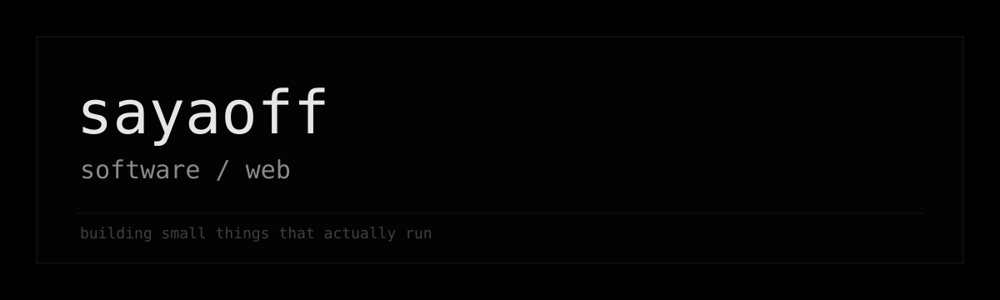

  

  <h1>🍉 sayaoff / software & web developer</h1>

  

    
  

   

  

   
   

  

    <b>Building websites, desktop tools, and small apps that solve real problems.</b>
  

  

    Currently working on <a href="https://github.com/sayaoff/KIT"><b>KIT</b></a> — a Windows app for managing a CS2 gaming setup around game sessions.
  

   

  <picture>
    <source media="(prefers-color-scheme: dark)" srcset="https://raw.githubusercontent.com/sayaoff/sayaoff/output/github-contribution-grid-snake-dark.svg" />
    <source media="(prefers-color-scheme: light)" srcset="https://raw.githubusercontent.com/sayaoff/sayaoff/output/github-contribution-grid-snake.svg" />
    
  </picture>

